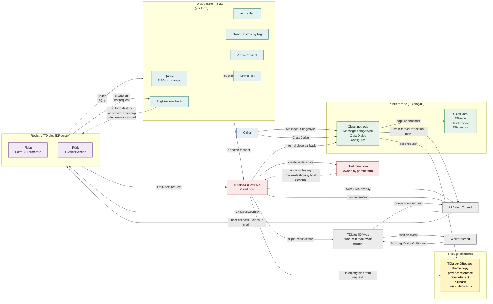
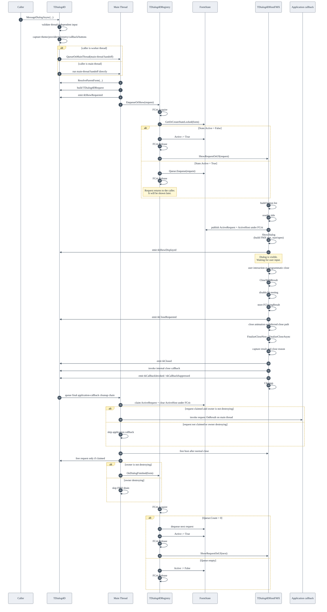
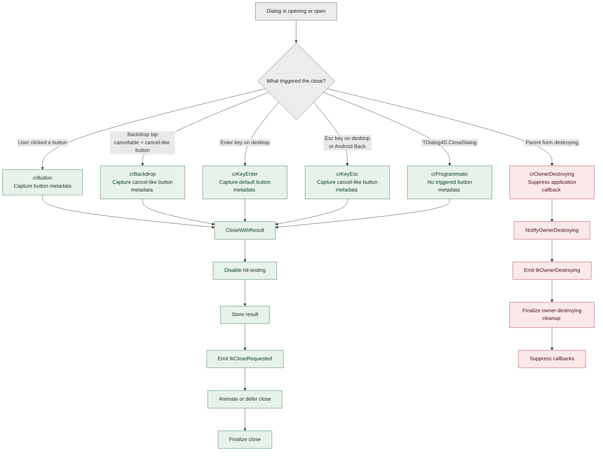
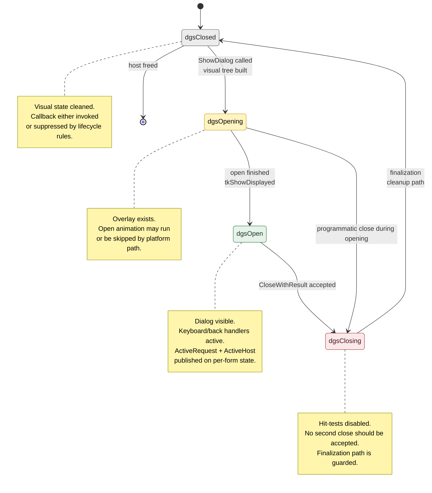
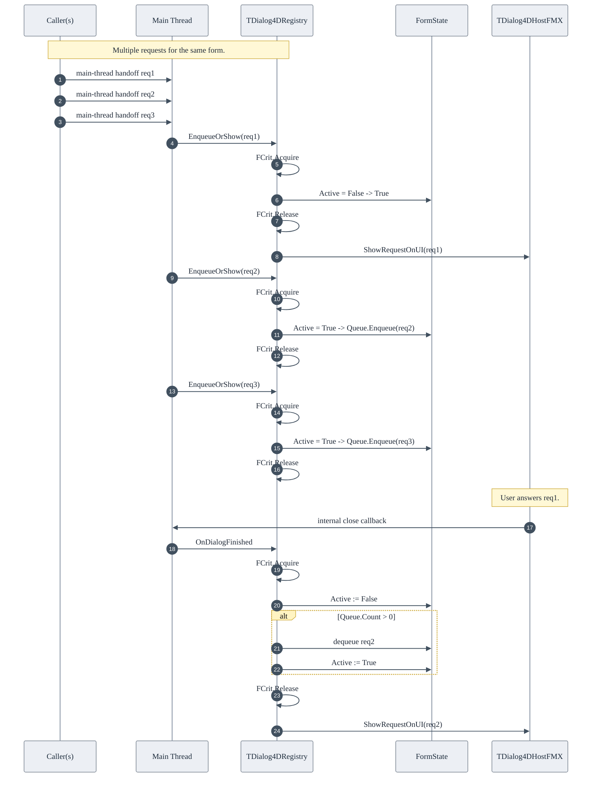
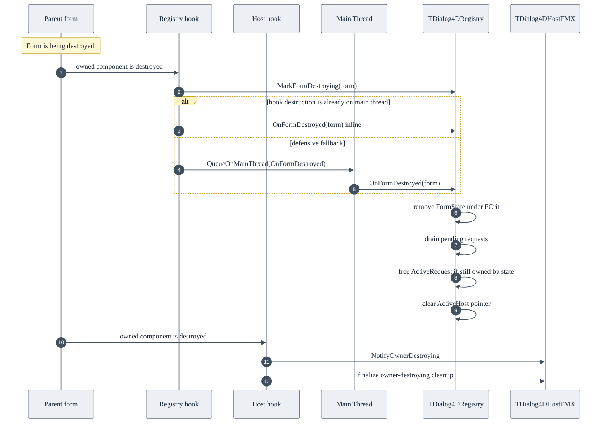
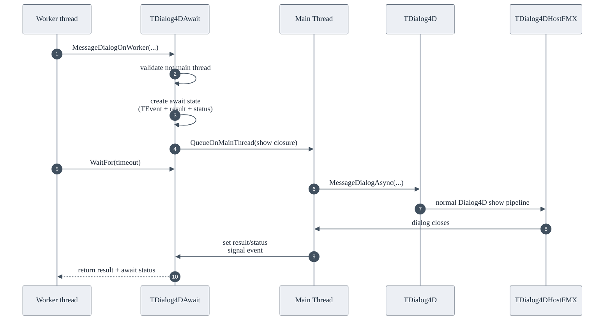

# Dialog4D Architecture

**Version:** 1.0.2 — 2026-06-21

Dialog4D is an FMX-rendered asynchronous dialog library with explicit roles,
state transitions, request snapshots, per-form queueing, and lifecycle
boundaries.

Dialog4D does not redefine the role of `FMX.DialogService`. FireMonkey's
built-in dialog service remains appropriate for applications that want the
standard platform-oriented dialog behavior provided by FMX.

The purpose of Dialog4D is to make a specific set of dialog concerns easier to
handle in FMX applications: themed FMX overlays, per-form request
serialization, request-time configuration snapshots, structured telemetry, and
explicit asynchronous decision flow.

This document complements the README by describing the mechanism from the
inside: who owns what, which thread executes each step, how requests are queued
per form, when configuration is captured, how close paths differ, how form
destruction is handled, and how the worker-thread await layer fits into the
overall pipeline.

---

## 1. Architectural map



### Reading the map

- **Caller**: form, view model, or worker code that calls
  `TDialog4D.MessageDialogAsync` or `TDialog4D.CloseDialog`.

- **Public facade** (`TDialog4D`): receives requests, validates input, captures
  request-time configuration, resolves the parent form on the main-thread
  execution path, emits `tkShowRequested`, and hands the request to the
  registry.

- **Global configuration**: `FTheme`, `FTextProvider`, and `FTelemetry` are the
  global configuration surface. They are intended to be configured during
  application initialization or another controlled configuration point, not as
  high-frequency concurrent mutation APIs.

- **Request snapshot** (`TDialog4DRequest`): captures the data needed to show
  one dialog. `TDialog4DTheme` is copied by value. The text provider,
  telemetry sink, and callback are captured as references/procedure values.
  Custom button arrays are copied so later caller-side mutations do not affect
  an already requested dialog.

- **Registry** (`TDialog4DRegistry`): process-wide coordinator that maps each
  parent form to a `TDialog4DFormState`. It serializes requests per form using
  a FIFO queue guarded by a `TCriticalSection`.

- **Per-form state** (`TDialog4DFormState`): holds the pending FIFO queue, the
  active request and active host pointers, the owner-destroying flag, and the
  registry-facing form hook.

- **Visual host** (`TDialog4DHostFMX`): one instance per visible dialog. It owns
  the FMX overlay, visual tree, input handling, layout recalculation,
  animation path, close pipeline, and per-instance telemetry emission.

- **Form hooks**: there are two distinct hook responsibilities:
  - the registry hook marks the per-form state as owner-destroying and cleans
    the registry state when the parent form is destroyed. When the hook is
    already running on the main thread, cleanup is performed inline; the queued
    path remains only as a defensive fallback for off-main-thread destruction;
  - the host hook handles owner-destroying cleanup for the active visual host.

- **Await layer** (`TDialog4DAwait`): optional worker-thread helper built on top
  of `TDialog4D.MessageDialogAsync`. It gives worker code blocking wait
  semantics without turning the main-thread UI pipeline into a synchronous
  dialog model.

- **UI / main thread**: all FMX visual work happens on the main thread. Calls
  made from worker threads are marshalled before the registry or visual host
  touches FMX state.

---

## 2. Main flow: from request to result callback



### What this means

- `MessageDialogAsync` is asynchronous with respect to the user decision: it
  never blocks waiting for the user to answer.

- If called from a worker thread, the registry handoff and all FMX work are
  queued to the main thread. If called from the main thread, the handoff may run
  immediately on the current stack. In both cases, the result is delivered later
  through the callback pipeline.

- `tkShowRequested` is emitted on the main-thread execution path before the
  registry decides whether the request will be displayed immediately or queued
  behind an existing active dialog.

- `ActiveRequest` and `ActiveHost` are published under `FCrit`. This is what
  lets `TDialog4D.CloseDialog` find the active host safely: it snapshots the
  host pointer under the same lock, then invokes `CloseProgram` outside the
  lock.

- The visual host invokes an internal close callback supplied by the public
  facade. The facade then queues the final application-callback cleanup chain
  from a clean main-loop stack. Before invoking the application callback, that
  queued chain claims `ActiveRequest` and `ActiveHost` under `FCrit`. If the
  parent form entered owner-destroying cleanup first, the request may already
  have been released by the form state and the queued chain skips the
  application callback and request free path.

- When one dialog finishes and the parent form is still valid for Dialog4D
  processing, `OnDialogFinished` drains the next request from the per-form FIFO.
  If a next request exists, `Active` is set back to `True` before the lock is
  released so concurrent requests cannot race the dispatch. If the form state
  is marked owner-destroying, FIFO draining is skipped and pending requests are
  discarded by form-state cleanup.

---

## 3. Close pipeline and callback semantics

The close pipeline has two callback layers:

1. **Internal close callback** — the callback passed by `Dialog4D.pas` to the
   visual host. It is part of the Dialog4D infrastructure.
2. **Application callback** — the `OnResult` callback originally supplied by the
   caller.

Telemetry event `tkCallbackInvoked` belongs to the Dialog4D close-callback
pipeline. It should not be interpreted as a guarantee that arbitrary downstream
application code completed successfully. The application callback is invoked by
the public facade as part of the queued final cleanup chain.

### Cleanup ordering

The host finalization path keeps this ordering:

```text
1. Capture result and close reason
2. Emit tkClosed telemetry
3. Invoke or suppress the internal close callback
4. Emit callback telemetry for the Dialog4D callback pipeline
5. Cleanup visual state
```

The capture must happen before cleanup because cleanup resets state and snapshot
fields. The telemetry emitted around finalization must still be able to report
the effective close reason, result, title, message length, button count, and
triggered-button metadata.

The public facade then runs the final application callback and request cleanup
from a queued main-thread callback.

### Ownership claim in the final callback

The queued final callback performs an ownership claim before touching the active
request snapshot.

Under `FCrit`, it checks whether the per-form state still owns the same
`ActiveRequest` and `ActiveHost`. If so, it clears those fields and the queued
callback becomes responsible for the final application callback, request free,
host free, and FIFO drain decision.

If the per-form state was already removed because the parent form entered
destruction, the queued callback cannot claim the request. In that case it does
not touch the request snapshot and does not invoke the application callback.

This prevents the active request from being released by both the form-state
destructor and the queued final callback in reentrant form-destruction
scenarios.

### Callback exceptions

If the internal close callback raises, the host records the exception message in
telemetry and swallows the exception. This protects the visual close pipeline
from being left in a partial state.

Application callback exceptions should be handled by the application when the
callback performs domain-specific work. Dialog4D's design goal is to complete
dialog cleanup predictably; it is not a substitute for application-level error
handling.

---

## 4. Alternate paths: how a dialog can close



### Contract by close path

- **`crButton`**: user clicked or tapped a rendered button. Metadata is captured
  from the button's `TagObject`, allowing telemetry to report button kind,
  caption, and default status.

- **`crBackdrop`**: user tapped the backdrop while `ACancelable = True` and a
  cancel-like button exists. Telemetry uses the cancel-like button metadata
  because that is the logical result associated with the backdrop action.

- **`crKeyEnter`**: Enter key on desktop platforms. Resolves to the default
  button. If the requested default is invalid, the normalized button list
  promotes a valid fallback.

- **`crKeyEsc`**: Esc key on desktop or hardware Back on Android. Resolves to a
  cancel-like button when available and the dialog is cancelable. On Android,
  the back key is consumed to prevent activity-level navigation from treating
  the event as a screen back action while the dialog is active.

- **`crProgrammatic`**: `TDialog4D.CloseDialog` requested closure. No rendered
  button caused this result, so triggered-button metadata is reset.

- **`crOwnerDestroying`**: parent form destruction cancels the dialog context.
  Application callbacks are suppressed. The owner-destroying path emits
  `tkOwnerDestroying` and finalizes the host cleanup path without treating the
  destruction as a normal user decision.

---

## 5. State model



### Why hit-tests are disabled at close start

The first action of `CloseWithResult` is to disable hit-testing on the overlay,
backdrop, and card. This closes the window where a user could trigger a second
close while the close animation or deferred finalization path is still running.

### Reentrancy guards

The visual host uses main-thread reentrancy guards:

- `FFinalizing` prevents a second finalization pass.
- `FHandlingResize` prevents recursive resize/layout recalculation.
- `FRebuildingButtons` prevents nested button rebuilds during layout changes.

These are not cross-thread locks. They are main-thread reentrancy guards for
FMX callbacks and layout behavior.

### Android-specific behavior

Two visual-host paths are intentionally different on Android:

1. Opening may skip the desktop animation path.
2. Close finalization is deferred to the main loop so the visual tree is not
   destroyed inline during touch, gesture, or hardware-back processing.

---

## 6. Per-form FIFO queue flow



### Why the FIFO is per-form

Each parent form has its own `TDialog4DFormState`, so dialogs targeting
different forms do not block each other. Within one form, requests are serialized
in arrival order.

This matches multi-window UI expectations: unrelated windows can own unrelated
dialog sequences, while one form does not display overlapping Dialog4D
overlays.

### Lock discipline

`FCrit` guards:

- the registry dictionary;
- each per-form `Active` flag;
- each per-form `OwnerDestroying` flag;
- each per-form request queue;
- `ActiveRequest` and `ActiveHost` publication.

The lock is held only for short operations: lookup, enqueue/dequeue, and pointer
publication. FMX operations and object destruction happen outside the lock.

This lock-narrow-then-dispatch pattern avoids holding a critical section across
visual operations or callback paths.

When a form enters owner-destroying cleanup, the registry marks the per-form
state with `OwnerDestroying = True`. After that point, new requests for that
state are discarded, programmatic close is ignored, and `OnDialogFinished` does
not drain the next queued request. The form-state destructor is responsible for
discarding any pending requests still owned by the state.

---

## 7. Form-destruction safety

Form destruction can occur while no dialog exists, while a dialog is visible,
while requests are queued, during close, or during application shutdown.
Dialog4D uses form-owned hooks to keep the registry and host from keeping stale
references to destroyed forms.

In version 1.0.2, the registry-facing hook was tightened for Android teardown:
when the hook destructor is already running on the main thread, per-form
registry cleanup runs synchronously instead of being deferred to a later
main-loop turn. The deferred path still exists only as a defensive fallback for
unexpected off-main-thread teardown.



### Why the registry hook marks before cleanup

The registry hook first marks the per-form state as owner-destroying. This mark
is intentionally performed before the form finishes tearing down.

The early mark is important: it prevents later Dialog4D cleanup paths from
invoking the application callback or draining the FIFO after the form has begun
teardown.

A common example is an exit confirmation:

```delphi
TDialog4D.MessageDialogAsync(
  'Exit the application?',
  TMsgDlgType.mtConfirmation,
  [TMsgDlgBtn.mbOk, TMsgDlgBtn.mbCancel],
  TMsgDlgBtn.mbCancel,
  procedure(const AResult: TModalResult)
  begin
    if AResult = mrOk then
      Close;
  end);
```

This is a supported scenario. The callback closes the same form that hosted the
dialog, so the registry state for that form must be marked as owner-destroying
as soon as the form begins destruction.

### Why registry cleanup is inline on the main thread

The registry hook used to defer `OnFormDestroyed` through the main-thread queue.
That was safe for ordinary form cleanup, but it left a narrow lifecycle window
during Android application teardown: the form could be closing and the
application could be finalizing while the registry cleanup closure was still
waiting for a later main-loop turn.

Version 1.0.2 changes the rule:

- if the hook destructor is already running on the main thread, call
  `OnFormDestroyed` inline;
- if the hook destructor ever runs off the main thread, queue cleanup back to
  the main thread as a defensive fallback.

This keeps the normal FMX rule intact — registry cleanup still runs on the main
thread — while avoiding late queued cleanup during main-form teardown.

### What `OnFormDestroyed` is allowed to do

`OnFormDestroyed` is a registry cleanup operation. It must not touch the FMX
visual tree or inspect the form's visual children.

Its job is limited to internal state:

- remove the per-form state from the registry map under `FCrit`;
- discard pending request snapshots for that form;
- free `ActiveRequest` only if the form state still owns it;
- clear the published `ActiveHost` pointer;
- leave visual-host teardown to the host owner-destroying path or the normal
  final callback path.

This keeps form destruction safe even when it is re-entered from an application
callback.

### Why active host pointers are not owned by form state

`TDialog4DFormState` publishes the active host pointer so `CloseDialog` can
find it. It does not own the host. When form state is destroyed, it clears the
active host pointer but does not free the host directly.

The active visual host is handled either by the host owner-destroying path or by
the queued final callback after a normal close.

`ActiveRequest` is different: it is owned either by the form state or by the
queued final callback. The queued final callback claims it under `FCrit` before
use. If the form state is destroyed before that claim happens, the form-state
destructor releases the request. These two paths are mutually exclusive.

### Internal lifecycle trace

`Dialog4D.pas` contains an optional internal trace switch for diagnosing
registry/form teardown behavior:

```delphi
{.$DEFINE DIALOG4D_TRACE}
```

The trace is disabled by default. To enable it temporarily, change the directive
to:

```delphi
{$DEFINE DIALOG4D_TRACE}
```

When enabled, Dialog4D writes lifecycle messages through `FMX.Types.Log.d` with
the `[Dialog4D]` prefix. On Android, these messages can be captured with
`adb logcat` and filtered together with native crash markers.

The trace is intended for diagnostics only. It should normally remain disabled
for release builds and for routine demo execution.

### What the application observes

When the parent form is destroyed:

- the per-form state is marked owner-destroying;
- pending requests for that form are discarded;
- the active dialog, if any, is canceled as part of the form context teardown;
- application result callbacks are suppressed when the owner-destroying path
  wins ownership before the final callback claim;
- FIFO draining is skipped for that form;
- owner-destroying telemetry is emitted by the active host path when applicable.

Form destruction is treated as context cancellation, not as a user decision.

---

## 8. Worker-thread integration

`Dialog4D.Await` is an optional helper layer built on top of
`TDialog4D.MessageDialogAsync`. It lets worker code wait for a dialog result
without blocking the UI thread.

### Why Await matters

`Dialog4D.Await` is one of the most distinctive parts of the library.

It does not turn the dialog pipeline into a synchronous UI dialog. Instead, it
provides synchronous wait semantics for worker threads while preserving the
normal asynchronous main-thread dialog flow.

In practice, this means:

- the worker thread can wait for a result;
- the UI thread remains free to render and process the dialog;
- the dialog is still created and closed through the normal Dialog4D
  asynchronous pipeline;
- timeout ends only the worker wait, not the visual dialog itself.

Conceptually, `Dialog4D.Await` is a bridge between a blocking worker-side flow
and a non-blocking UI-side dialog flow.



### Why `MessageDialogOnWorker` is forbidden on the main thread

The main thread is responsible for rendering and processing the dialog. If it
blocked waiting for the dialog result, the dialog would not be able to complete.
For that reason, `MessageDialogOnWorker` raises `EDialog4DAwait` when called
from the main thread.

### Timeout semantics

Timeout does not close the visual dialog. It only ends the worker wait. On
timeout:

- status is `dasTimedOut`;
- result is `mrNone`;
- the worker returns;
- the dialog may still remain visible;
- smart worker-side overload callbacks are not invoked after timeout.

If the application wants to dismiss the still-visible dialog after a timeout, it
can request `TDialog4D.CloseDialog` separately.

### The smart `MessageDialog` overload

`TDialog4DAwait.MessageDialog` adapts to the calling thread:

- on the main thread, it delegates to `MessageDialogAsync`;
- on a worker thread, it delegates to `MessageDialogOnWorker`.

When called from a worker thread, `ACallbackOnMain = True` redispatches the
callback to the main thread. When `ACallbackOnMain = False`, the worker-side
callback runs on the worker thread after the wait completes.

This is why `Dialog4D.Await` can feel synchronous from the point of view of the
worker code while the UI pipeline remains fully asynchronous.

---

## 9. Configuration snapshots

Dialog4D uses request-time snapshots to keep queued dialogs stable.

At request time, `TDialog4D.MessageDialogAsync` captures:

- theme values;
- text-provider reference;
- telemetry sink;
- result callback;
- standard button set or a copied custom-button array;
- title, message, dialog type, cancelable flag, and parent form.

The theme is a record and is copied by value. That is why `TDialog4DTheme` is
intended to contain value fields only. Custom-button arrays are copied so the
caller cannot mutate a queued request accidentally by changing the original
dynamic array after the call.

Provider, telemetry sink, and callback values are captured as references or
procedure values. Dialog4D captures which provider/sink/callback should be used;
it does not clone arbitrary objects behind those references.

---

## 10. Telemetry interpretation

Dialog4D telemetry is best-effort observability. It is intended for logging,
diagnostics, demos, and light auditing of dialog flow.

The lifecycle events are:

- `tkShowRequested` — request entered the public API path.
- `tkShowDisplayed` — the visual host became visible.
- `tkCloseRequested` — a close trigger was accepted.
- `tkClosed` — the host reached the closed finalization path.
- `tkCallbackInvoked` — Dialog4D's close-callback pipeline invoked its callback
  stage.
- `tkCallbackSuppressed` — callback execution was intentionally skipped.
- `tkOwnerDestroying` — the parent form began destruction while a dialog was
  active.

Telemetry sink exceptions are swallowed by Dialog4D so instrumentation cannot
break the dialog flow.

### Important boundary

Telemetry records the Dialog4D lifecycle. It should not be treated as proof that
an arbitrary domain operation launched by an application callback completed
successfully. Domain success/failure belongs to application logic.

---

## 11. Practical interpretation

The mechanism can be understood as five roles:

1. **Caller / UI owner**  
   Configures theme/provider/telemetry at startup or a controlled configuration
   point. Requests dialogs and optionally requests programmatic close.

2. **Public facade** (`TDialog4D`)  
   Validates input, captures request-time configuration, resolves parent form on
   the main-thread execution path, emits request telemetry, and hands the
   request to the registry.

3. **Registry** (`TDialog4DRegistry`)  
   Coordinates per-form FIFO queues, active request/host publication,
   owner-destroying state, ownership transfer of the active request, and cleanup
   of per-form state.

4. **Visual host** (`TDialog4DHostFMX`)  
   Builds and owns the FMX overlay, handles input, emits host lifecycle
   telemetry, and finalizes the close pipeline.

5. **Await helper** (`TDialog4DAwait`)  
   Bridges worker-thread blocking semantics and the asynchronous UI dialog
   pipeline when a background workflow needs to wait for a decision.

If those five roles are clear, the rest of the mechanism becomes easier to
reason about.

---

## 12. Reading guidance

Use the diagrams in this order:

1. **Architectural map** — understand the main parts and ownership boundaries.
2. **Main flow** — follow a request from API call to application callback.
3. **Close pipeline** — understand internal callback semantics and cleanup
   ordering.
4. **Alternate close paths** — understand close reasons and owner destruction.
5. **State model** — understand host states and main-thread reentrancy guards.
6. **Per-form FIFO queue flow** — understand serialization and lock discipline.
7. **Form-destruction safety** — understand why hooks and deferred cleanup are
   used.
8. **Worker-thread integration** — understand await and timeout boundaries.
9. **Configuration snapshots** — understand what is copied and what is
   referenced.
10. **Telemetry interpretation** — understand what telemetry does and does not
    prove.

---

*This document complements the README by describing the mechanism from the
inside. For project-level information, see [README.md](../README.md).*
